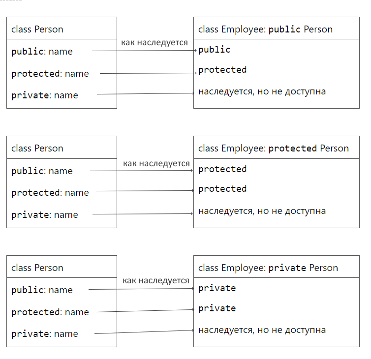

1. [Наследование](#методы)
    - [Публичное, приватное и защищенное наследование](#константные-методы)
    - [Конструкторы и деструторы при наследовании](#статические-методы)
    - [Установка публичного доступа](#установка-публичного-доступа)
    - [Видимость и доступность](#видимость-и-доступность)
    - [Доступ к protected и private полям через базовый класс в наследнике](#доступ-к-protected-и-private-полям-через-базовый-класс-в-наследнике)

# Наследование
## Публичное, приватное и защищенное наследование

Все проверки на уровень доступа происходят только в compile-time.

Существует три типа уровня доступа: public, protected, private. Можно не писать ключевые слова public, private, protectetd при наследовании, в таком случае у классов по умолчанию оно private, а у структур - public.

Если переменные или функции в базовом классе являются закрытыми, то есть объявлены со спецификатором private, то производный класс хотя и наследует эти переменные и функции, но не может к ним обращаться.

Примеры наследования:



Если члены базового класса определены со спецификатором private, то в производном классе они в принципе недоступны независимо от спецификатора доступа к базовому классу.

Если спецификатор базового класса - public, то уровень доступа унаследованных членов остается неизменным. Таким образом, унаследованные открытые члены являются общедоступными, а унаследованные члены со спецификатором protected сохраняют этот спецификатор и в производном классе.

Если спецификатор базового класса - protected, то все унаследованные члены со спецификатором protected и public в производном классе наследуются как protected. Смысл этого состоит в том, что если у производного класса будут свои классы-наследники, то в этих классах-наследниках также можно обращаться к подобным членам базового класса.

Если спецификатор базового класса - private, то все унаследованные члены со спецификатором protected и public в производном классе наследуются как private. Они доступны в любой функции производного класса, но вне производного класса (в том числе у его наследников) они не доступны.

```C++
#include <iostream>
 
class Person
{
public:
    void print() const
    {
        std::cout << "Name: " << name << "\tAge: " << age << std::endl;
    }
    std::string name;       //  имя
    unsigned age;           // возраст
};
class Employee : public Person
{
public:
    std::string company;    // компания
};
 
int main()
{
    Person tom;
    tom.name = "Tom";
    tom.age = 23;
    tom.print();    // Name: Tom       Age: 23
  
    Employee bob;
    bob.name = "Bob";
    bob.age = 31;
    bob.company = "Microsoft";
    bob.print();    // Name: Bob       Age: 31
}
```

## Конструкторы и деструторы при наследовании

Конструкторы не наследуются, так как не являются членами интерфейса класса, исключение составляет конструктор по умолчанию. В этом случае перед вызовом конструктора по умолчанию наследника вызывается конструктор по умолчанию родительского объекта для наследника. Однако конструктор с нетривиальным списком аргументов унаследован быть не может. Уничтожение объекта производного класса может вовлекать как собственно деструктор производного класса, так и деструктор базового класса.

```C++
#include <iostream>

// Конструктор по умолчанию

using namespace std;

class A
{
public:
    A() { cout << "create A" << endl; }
    ~A() { cout << "delete A" << endl; }
};

class B : private A
{
public:
    B() { cout << "create B" << endl; }
    ~B() { cout << "delete B" << endl; }
};
 
int main()
{
    B b;  // create A
          // create B
          // delete B
          // delete A
}
```

Если конструктор у наследника нетривиальный, нужно использовать делегирующий конструктор. Если этого не сделать, поля базового класса будут проинициалированы по умолчанию.

```C++
// Конструктор базового класса
public:
    Person(std::string name, unsigned age)
    {
        this->name = name;
        this->age = age;
        std::cout << "Person created" << std::endl;
    }

// Конструктор наследника
public:
    Employee(std::string name, unsigned age, std::string company): Person(name, age)
    {
        this->company = company;
        std::cout << "Employee created" << std::endl;
    }
```

Начиная с C++11, чтобы для каждого из конструкторов базового класса не дублировать код в наследнике можно использовать using. В таком случае при объявлении переменной Employee() будет вызываться подходящий конструктор Person. Все поля Employee при этом будут проинициализированы по умолчанию.

```C++
public:
    using Person::Person;
```

## Установка публичного доступа

Можно восстановить уровень доступа при помощи ключевого слова using. Подобным образом можно сделать добавить доступ для тех функций и переменных, которые изначально были **public** и **protected**, но не **private**.

```C++
// В теле наследника
public:
    using Person::print; // теперь print стал public, даже если наследование было private
                         // сработает только если Person::print изначально сам не был private
```

## Видимость и доступность

Сначала проверяется видимость, а только потом доступность переменной или метода. В данном случае к методам f1, f2, а также переименной a родительского класса можно доступиться только если явно разрешить пространство Mom:: . Метод f2 у наследника нельзя вызвать в main даже если в родительском классе он был public т.к. его затмил protected метод f2.

```C++
#include <iostream>

class Mom {
public:
    int a = 0;
    void f1() {
        std::cout << "Mom f1\n";
    }
    void f2() {
        std::cout << "Mom f2\n";
    }
};

class Son: public Mom {
public:
    int a = 1;   // Затмили переменную
    void f1() {  // Затмили метод
        std::cout << "Son f1\n";
    }
protected:
    void f2() {  // Затмили метод
        std::cout << "Son f2\n";
    }
};

int main() {
    Son s;

    s.f1(); // Son f1
    std::cout << s.a << std::endl; // 1

    s.Mom::f1(); // Mom f1
    std::cout << s.Mom::a << std::endl; // 0  

 // s.f2(); // CE - доступность проверяется после разрешения перегрузки и выбора версий
    s.Mom::f2(); // OK
}
```

Сначала компилятор выбирает тех кто претендует на вызов, а потом разрешает перегрузку.

```C++
#include <iostream>

class Mom {
public:
    int a = 0;
    void f(double) {  // Этот метод мы затмили в наследнике
        std::cout << "Mom\n";
    }
};

class Son: Mom {
public:
    int a = 1;
    void f(int) {  // Затмили  метод
        std::cout << "Son\n";
    }
};

int main() {
    Son s;
    s.f(0.0); // Son - f(int) затмевает функцию с таким же именем у родительского класса и будет неявное приведение к int
}
```

## Доступ к protected и private полям через базовый класс в наследнике

Нельзя внутри наследника обращаться к protected и private полям через базовый класс. Так решил комитет по стандартизации.

```C++
#include <iostream>
 
class Person
{
public:
    int pub{0};
protected:
    int pro{1};
private:
    int pri{2};
};
 
class Employee: protected Person {
public:
    void g(const Person& x) {
        Person p;
        std::cout << p.pub << "" << x.pub << "\n";  // ОК!
        std::cout << p.pro << "" << x.pro << "\n";  // нельзя!
        std::cout << p.pri << "" << x.pri << "\n";  // нельзя!
    }
    void g(const Employee& x) {
        Employee e;
        std::cout << e.pub << "" << x.pub << "\n";  // ОК!
        std::cout << e.pro << "" << x.pro << "\n";  // ОК!
        std::cout << e.pri << "" << x.pri << "\n";  // нельзя!
    }
};

int main() {
    Person p;
    Employee e;

    Employee ee;
    ee.g(p);
    ee.g(e);
}
```
