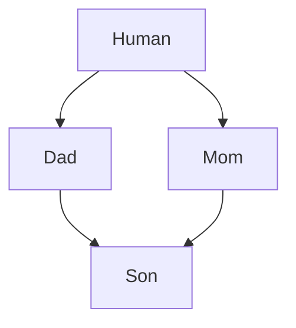
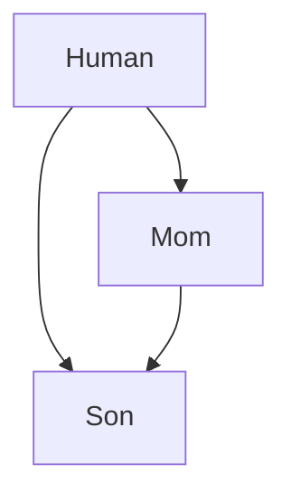

<!-- 1. [Приведедие типов при наследовании](#приведедие-типов-при-наследовании)
    - [Каст от потомка к родителю](#каст-от-потомка-к-родителю)
    - [Каст от родителя к потомку](#каст-от-родителя-к-потомку)
    - [Empty base optimization](#empty-base-optimization) -->

# Множественное наследование

Если у потомка есть метод с такой же сигнатурой как у одного из родителей, при вызове он будет предпочтительней. Если есть два метода с одинаковыми сигнатурами у родительских классов будет CE.

Конструкторы вызываются в том же порядке, в каком объявлены. Сначала родительские, а потом общий потомок. В памяти они так же уложены в том же порядке, как и объявлены. Сначала Mom, потом Ded и потом Son.

```C++
#include <iostream>

struct Mom {
    Mom() {std::cout << "Mom::Mom ";}
    void f() {std::cout << "Mom::f\n";}
    void same() {std::cout << "Mom::same\n";}
    int m = 1;
};

struct Ded {
    Ded() {std::cout << "Ded::Ded ";}
    void f() {std::cout << "Ded::f\n";}
    int d = 2;
};

struct Son: public Mom, public Ded {
    Son() {std::cout << "Son::Son\n";}
    void same() {std::cout << "Son::same\n";}
    int s = 3;
};

int main() {
    Son s; // Mom::Mom Ded::Ded Son::Son

//  s.f(); // Error, ambiguous call
    s.Mom::f(); // Mom::f
    s.Ded::f(); // Ded::f
    s.same();   // Son::same

    std::cout << sizeof(s) << '\n';  // 12
    // 0x7ffdd78a8ad4 0x7ffdd78a8ad8 0x7ffdd78a8adc
    std::cout << &s.m << " " << &s.d << " " << &s.s << "\n";
}
```

# Ромбовидное наследование (Diamond problem) и неоднозначные касты

## Ромбовидное наследование



При ромбовидном наследовании структура Son будет иметь следующий вид:

[ [[Human]Mom] [[Human]Ded] Son ]

В этом случае, при вызове метода или поля структуры Human нужно явно разрешать видимость **(s.Mom::age)**, иначе это ambiguous call.

```C++
#include <iostream>

struct Human {
    Human() {std::cout << "Human::Human ";}
    int h = 0;
};

struct Mom: public Human {
    Mom() {std::cout << "Mom::Mom ";}
    void f() {std::cout << "Mom::f\n";}
    void same() {std::cout << "Mom::same\n";}
    int m = 1;
};

struct Ded: public Human {
    Ded() {std::cout << "Ded::Ded ";}
    void f() {std::cout << "Ded::f\n";}
    int d = 2;
};

struct Son: public Mom, public Ded {
    Son() {std::cout << "Son::Son\n";}
    void same() {std::cout << "Son::same\n";}
    int s = 3;
};

int main() {
    Son s; // Human::Human Mom::Mom Human::Human Ded::Ded Son::Son

//  s.f(); // Error, ambiguous call
    s.Mom::f(); // Mom::f
    s.Ded::f(); // Ded::f
    s.same();   // Son::same

    std::cout << sizeof(s) << '\n';  // 20

//  std::cout << s.h << std::endl; // Error, ambiguous call

    std::cout << s.Mom::h << " " << s.Ded::h << std::endl; // 0   0
    s.Mom::h = 146;
    std::cout << s.Mom::h << " " << s.Ded::h << std::endl; // 168 0
}
```

## Недоступный базовый класс



При подобном наследовании структура Son будет иметь следующий вид:

[ [[Human]Mom] [Human] Son ]

> Доступ к методам и полям Mom::Human доступен, а попытка вызвать методы или поля Human приведет к CE. 

```C++
#include <iostream>

struct Human {
    Human() {std::cout << "Human::Human ";}
    int g = 1;
};

struct Mom: public Human {
    Mom() {std::cout << "Mom::Mom ";}
    void same() {std::cout << "Mom::same\n";}
    int m = 2;
};

struct Son: public Mom, public Human {
    Son() {std::cout << "Son::Son\n";}
    void same() {std::cout << "Son::same\n";}
    int s = 3;
};

int main() {
    Son s; // Human::Human Mom::Mom Human::Human Son::Son

    s.same();   // Son::same

    std::cout << sizeof(s) << '\n';  // 16

    std::cout << &s.s << "\n";        // 0x7ffe71e7639c
    std::cout << &s.m << "\n";        // 0x7ffe71e76394
    std::cout << &s.Mom::g << "\n";   // 0x7ffe71e76390
//  std::cout << &s.g << "\n";        // Error
//  std::cout << &s.Human::g << "\n"; // Error
}
```

## Приведение типов при множественных указателях

```C++
```