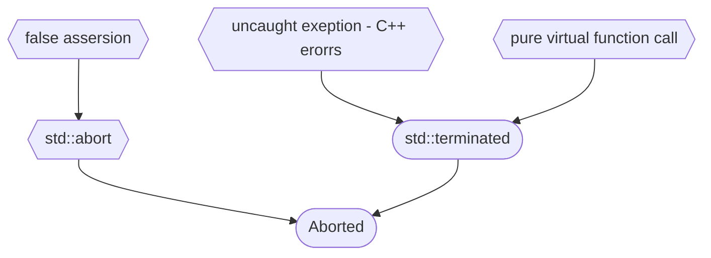

#exeptions #исключения

[Metanit exeptions](https://metanit.com/cpp/tutorial/6.2.php)

>Можно писать catch (...) , чтобы поймать ошибку любого типа

Все исключения в языке C++ описываются типом exception, который определен в заголовочном файле **exception**. Ловить через конструкцию try catch можно только то, что было брощено оператором throw. Деление на 0, доступ out of range и т.д явлюятся ошибками, но не бросают throw.

Глобально, стандартные исплючения разделяются на два больших подвида: logic_error и runtime_error. Идея следующая: logic_error - ошибка в которой виноват программист, а runtime_error - ошибка в которой он не виноват, но что-то пошло не так.

Стандартные операторы, которые бросают исключения:
- new
- dynamic_cast
- throw
- typeid

```C++
#include <iostream>
#include <cstdlib>

int divide(int a, int b) {
	if (b == 0) {
		throw std::logic_error("Divide by zero!");
	}
	return a/b;
}

int main() {
	try {
		divide(1, 0);
	}
	catch (std::logic_error& err) {
		std::cout << err.what();
	}
}
```

Низкоуровневые причины из-за которых программы падают
**Segmentation fault:**

**Floating Point Exeption:**

**Aborted:**


https://www.youtube.com/watch?v=4Erj9hR6UsM
5:00