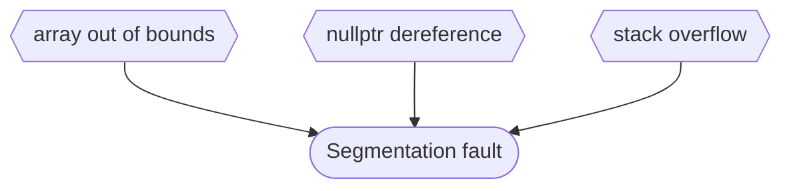
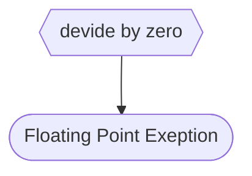
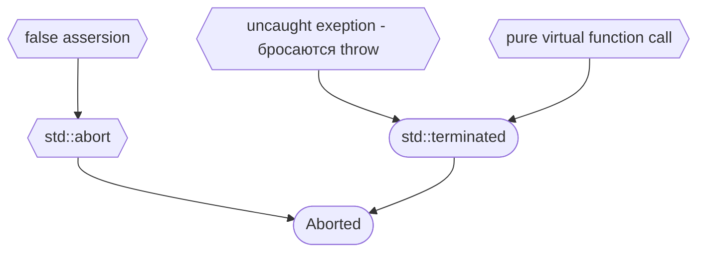

#exeptions #исключения

[Metanit - обработка исключений](https://metanit.com/cpp/tutorial/6.1.php)
[Metanit - тип exeption](https://metanit.com/cpp/tutorial/6.2.php)

Исключение представлякт временный объект любого типа, который используется для сигнализации об ошибке. Цель объекта-исключения состоит в том, чтобы передать информацию из точки, в которой произошла ошибка, в код, который должен ее обработать. Если исключение не обработано, то при его возникновении программа прекращает свою работу.

>Можно писать catch (...) , чтобы поймать ошибку любого типа

Конструкция try - catch очень "дорогая" в использовании и в некоторых кодстайлах из-за этого запрещена.

Одни конструкции try-catch могут содержать другие. Если исключение возникает во вложенной конструкции try-catch, то программа сначала ищет во вложенной конструкции блок catch, который обрабатывает нужный тип исключения. Если во вложенной конструкции try-catch такой блок catch не найден, то программа начинает искать аналогичный блок catch во внешей конструкии try-catch.
##### Виды исключений

Все исключения в языке C++ описываются типом std::exception, который определен в заголовочном файле **exception**. Ловить через конструкцию try catch можно только то, что было брощено оператором throw. Деление на 0, доступ out of range и т.д являются ошибками, но не бросают throw.

Глобально, стандартные исплючения разделяются на два больших подвида: logic_error и runtime_error. Идея следующая: logic_error - ошибка в которой виноват программист, а runtime_error - ошибка в которой он не виноват, но что-то пошло не так. Основные типы исключений:

- runtime_error: общий тип исключений, которые возникают во время выполнения
    
- range_error: исключение, которое возникает, когда полученный результат превосходит допустимый диапазон
    
- overflow_error: исключение, которое возникает, если полученный результат превышает допустимый диапазон
    
- underflow_error: исключение, которое возникает, если полученный в вычислениях результат имеет недопустимое отрицательное значение (выход за нижнюю допустимую границу значений)
    
- logic_error: исключение, которое возникает при наличии логических ошибок к коде программы
    
- domain_error: исключение, которое возникает, если для некоторого значения, передаваемого в функцию, не определен результат
    
- invalid_argument: исключение, которое возникает при передаче в функцию некорректного аргумента
    
- length_error: исключение, которое возникает при попытке создать объект большего размера, чем допустим для данного типа
    
- out_of_range: исключение, которое возникает при попытке доступа к элементам вне допустимого диапазона

![[exeption.png]]

Стандартные операторы, которые бросают исключения:
- new
- dynamic_cast
- throw
- typeid

```C++
#include <iostream>
#include <cstdlib>

int divide(int a, int b) {
	if (b == 0) {
		throw std::logic_error("Divide by zero!");
	}
	return a/b;
}

int main() {
	try {
		divide(1, 0);
	}
	catch (std::logic_error& err) {
		std::cout << err.what();
	}
}
```

Низкоуровневые причины из-за которых программы падают. Из них только __uncaught exeption__ бросается оператором throw:

**1 Segmentation fault:**

**2 Floating Point Exeption:**

**3 Aborted:**

***
#### Exeptions handling

Можно передать **throw** без аргументов - в таком случае исключение будет передаваться дальше, чтобы его поймало catch на более высоком уровне вложенности. Повторного копирования в таком случае не будет.

Если исключение выброшено, но не поймано вплоть до main - будет UB. Гарантируется, что мы упадем с вызовом terminate, но нет гарантий вызова деструкторов и т.д.

>В статической памяти заранее резервируется место под std::bed_alloc. В случае ниже будет копирование локальной переменной типа A в динамическую память.

```C++
#include <iostream>

struct A {
    int i = 46;
	A()  { std::cout << "A\n"; }
	A(const A&) { std::cout << "copy\n"; }
	~A() { std::cout << "~A\n"; }
};

void f(int x) {
	A a;
    std::cout << &a;
	if (x == 0) {
		throw a;
	}
}

int main() {
	// A
	// 0x7ffed8bf874c
	// copy
	// ~A
	// caught! 46 0x1f9cf40
	// A
	try {
		f(0);
	} catch (A& a) {
		std::cout << "caught! " << a.i << " " << &a << '\n';
	}
}
```

***
#### Принципы выбора версии catch

При возникновении исключения обработчики catch проверяются в той последовательности, в которой они определены в коде. И если будет найден первый блок catch, параметр которого соответствует типу исключения, то он выбирается для обработки исключения. Для исключений, которые являются базовыми типами (а не типами классов), необходимо точное совпадение типа исключения с типом параметра в блоке catch. А для исключений-объектов классов при сопоставлении могут применяться неявные преобразования. В этом случае обработчик catch выбирается, если

- Параметр в catch имеет тот же самый тип, что и исключение (`const` игнорируется)
    
- Тип параметра в catch представляет базовый класс для типа исключения или ссылку на базовый класс (`const` игнорируется)
    
- Исключение и параметр в catch представляют указатели, соответственно объект исключения может быть неявно преобразован к типу параметра (`const` игнорируется)

```C++
#include <iostream>

int main() {
	try {
		throw 1; // выведется "over"
	} catch (double d) { // conversion
		std::cout << "double";
	} catch (long long d) { // promoution
		std::cout << "long long";
	} catch (...) {
		std::cout << "other";
	}
}
```
##### Раздельная обработка исключений

Иногда может потребоваться выполнить раздельную обработку исключений базовых и производных классов, особенно когда необходимо вызвать какие-нибудь функции производных классов, которых нет в базовых. Поскольку объекты исключений могут сопоставляться с параметрами базовых классов в блоке catch, то обработку производных классов надо размещать перед обработкой базовых классов. Например, возьмем выше определенные классы Person, AgeException и MaxAgeException и обработаем типы исключений по-отдельности:

```C++
void testPerson(std::string name, unsigned age)
{
    try
    {
        Person person{name, age};
        person.print();
    }
    // сначала обрабатываем исключение производного типа
    catch (const MaxAgeException& ex)
    {
        std::cout << "MaxAgeException: " << ex.getMessage() << std::endl;
    }
    // потом обрабатываем исключение базового типа
    catch (const AgeException& ex)
    {
        std::cout << "AgeException: " << ex.getMessage() << std::endl;
    }
}

int main()
{
    testPerson("Tom", 0);    // AgeException: Invalid age
    testPerson("Bob", 1000); // MaxAgeException: Invalid age.
						     // Max age should be 110
}
```

***
#### Function try block

[cppreference ftb](https://en.cppreference.com/w/cpp/language/function-try-block)
catch можо поставить на все тело функции конструкцией function-try-block:

```C++
void f() try {
	std::cout << "f";
} catch (...) {
	std::cout << "caught!";
}
```

***
#### Exception safety
[cppreference](https://en.cppreference.com/w/cpp/language/exceptions)

Уровни гарантий:
1) Гарантия отсутствия исключений -  сводится к следующему: “ни при каких обстоятельствах функция не будет генерировать исключения”.
2) Строгая гарантия - если при выполнении операции возникает исключение, то это не должно оказать какого-либо влияния на состояние приложения. Cостояние программы возвращается к состоянию непосредственно перед вызовом функции.
3) Базовая гарантия - “при возникновении любого исключения в некотором методе, состояние программы должно оставаться согласованным”. Это означает, не только отсутствие утечек ресурсов, но и сохранение инвариантов класса, что является более общим критерием, по сравнению с базовым определением.
4) Отсутствие гарантий

***
#### Ключевое слово noexcept
#noexcept

Ключевое слово noexcept явно указывает, что функция не будет бросать исключения. Можно бросать исключения находясь в ней, но тогда обязан их поймать и обработать на этом же уровне.

> Если execption все таки будет брошено - вызовется std::terminate

```C++
#include <iostream>

// noexcept
void f() noexcept {}

// условный noexcept
// в данном случае noexcept - спецификатор
template <typename T>
void f() noexcept(std::is_reference_v<T>){}

int main() {
	// оператор (предикат) noexcept 
	// проверяет в compile-time бросает ли исключения
	// эта функция
	std::cout << noexcept(g<T>());
}
```