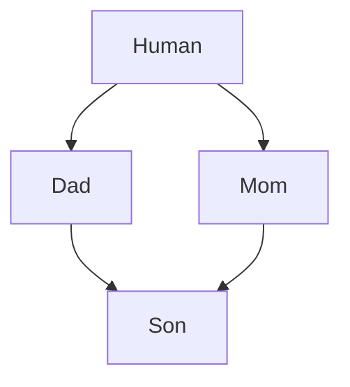
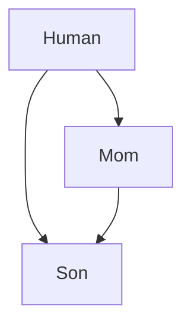

1. [Множественное наследование](#множественное-наследование)
2. [Приведение типов при наследовании](#приведение-типов-при-наследованиях)
3. [Проблемы наследования](#проблемы-наследования)
    - [Ромбовидное наследование (Diamond problem)](#ромбовидное-наследование-diamond-problem)
    - [Наследование с недоступным базовым классом](#наследование-с-недоступным-базовым-классом)
4. [Виртуальное наследование](#виртуальное-наследование)

# Множественное наследование

Если у потомка есть метод с такой же сигнатурой как у одного из родителей, при вызове он будет предпочтительней. Если есть два метода с одинаковыми сигнатурами у родительских классов будет CE.

Конструкторы вызываются в том же порядке, в каком объявлены. Сначала родительские, а потом общий потомок. В памяти они так же уложены в том же порядке, как и объявлены. Сначала Mom, потом Dad и потом Son.

Нельзя дважды наследоваться от одного класса: **public Mom, public Mom** - CE

```C++
#include <iostream>

struct Mom {
    Mom() {std::cout << "Mom::Mom ";}
    void f() {std::cout << "Mom::f\n";}
    void same() {std::cout << "Mom::same\n";}
    int m = 1;
};

struct Dad {
    Dad() {std::cout << "Dad::Dad ";}
    void f() {std::cout << "Dad::f\n";}
    int d = 2;
};

struct Son: public Mom, public Dad {
    Son() {std::cout << "Son::Son\n";}
    void same() {std::cout << "Son::same\n";}
    int s = 3;
};

int main() {
    Son s; // Mom::Mom Dad::Dad Son::Son

//  s.f(); // Error, ambiguous call
    s.Mom::f(); // Mom::f
    s.Dad::f(); // Dad::f
    s.same();   // Son::same

    std::cout << sizeof(s) << '\n';  // 12
    // 0x7ffdd78a8ad4 0x7ffdd78a8ad8 0x7ffdd78a8adc
    std::cout << &s.m << " " << &s.d << " " << &s.s << "\n";
}
```

# Приведение типов при наследованиях

Неявный каст от родителя к потомку - CE, нет конструктора. Можно через через static_cast к указателю, но это очень плохой кодстайл. Если нужно скастовать Son к Human, то придется делать static_cast сначала к одному из родителей, а потом уже к Human, иначе **umbiguos base**

При касте может сдвигаться указатель, например, если мы сделаеи static_cast от Son к Dad в следующем случае:

[ [Mom] [Dad] Son ]

# Проблемы наследования

## Ромбовидное наследование (Diamond problem)



При ромбовидном наследовании структура Son будет иметь следующий вид:

[ [[ Mom::h ] Mom::m ] [[ Dad::h ] Dad::d ] Son::s ]

В этом случае, при вызове метода или поля структуры Human нужно явно разрешать видимость **(s.Mom::age)**, иначе это ambiguous call.

```C++
#include <iostream>

struct Human {
    Human() {std::cout << "Human::Human ";}
    int h = 0;
};

struct Mom: public Human {
    Mom() {std::cout << "Mom::Mom ";}
    void f() {std::cout << "Mom::f\n";}
    void same() {std::cout << "Mom::same\n";}
    int m = 1;
};

struct Dad: public Human {
    Dad() {std::cout << "Dad::Dad ";}
    void f() {std::cout << "Dad::f\n";}
    int d = 2;
};

struct Son: public Mom, public Dad {
    Son() {std::cout << "Son::Son\n";}
    void same() {std::cout << "Son::same\n";}
    int s = 3;
};

// [ [[ Mom::h ] Mom::m ] [[ Dad::h ] Dad::d ] Son::s ]

int main() {
    Son s; // Human::Human Mom::Mom Human::Human Dad::Dad Son::Son

//  s.f(); // Error, ambiguous call
    s.Mom::f(); // Mom::f
    s.Dad::f(); // Dad::f
    s.same();   // Son::same

    std::cout << sizeof(s) << '\n';  // 20

//  std::cout << s.h << std::endl; // Error, ambiguous call

    std::cout << s.Mom::h << " " << s.Dad::h << std::endl; // 0   0
    s.Mom::h = 146;
    std::cout << s.Mom::h << " " << s.Dad::h << std::endl; // 146 0
}
```

## Наследование с недоступным базовым классом



При подобном наследовании структура Son будет иметь следующий вид:

[ [[Human]Mom] [Human] Son ]

> Доступ к методам и полям Mom::Human доступен, а попытка вызвать методы или поля Human приведет к CE. 

```C++
#include <iostream>

struct Human {
    Human() {std::cout << "Human::Human ";}
    int g = 1;
};

struct Mom: public Human {
    Mom() {std::cout << "Mom::Mom ";}
    void same() {std::cout << "Mom::same\n";}
    int m = 2;
};

struct Son: public Mom, public Human {
    Son() {std::cout << "Son::Son\n";}
    void same() {std::cout << "Son::same\n";}
    int s = 3;
};

int main() {
    Son s; // Human::Human Mom::Mom Human::Human Son::Son

    s.same();   // Son::same

    std::cout << sizeof(s) << '\n';  // 16

    std::cout << &s.s << "\n";        // 0x7ffe71e7639c
    std::cout << &s.m << "\n";        // 0x7ffe71e76394
    std::cout << &s.Mom::g << "\n";   // 0x7ffe71e76390
//  std::cout << &s.g << "\n";        // Error
//  std::cout << &s.Human::g << "\n"; // Error
}
```

# Виртуальное наследование

Если добавим ключевое слово **virtual** при наследовании, то больше не будет неопределенности и в классе будет только одна версия **Human**.

```C++
#include <iostream>

struct Human {
    Human() {std::cout << "Human::Human ";}
    int h = 0;
};

struct Mom: virtual public Human {
    Mom() {std::cout << "Mom::Mom ";}
    void f() {std::cout << "Mom::f\n";}
    void same() {std::cout << "Mom::same\n";}
    int m = 1;
};

struct Dad: virtual public Human {
    Dad() {std::cout << "Dad::Dad ";}
    void f() {std::cout << "Dad::f\n";}
    int d = 2;
};

struct Son: public Mom, public Dad {
    Son() {std::cout << "Son::Son\n";}
    void same() {std::cout << "Son::same\n";}
    int s = 3;
};

//      8          4      4         8          4         4           4      4
// [ mom_prt ][ Mom::m ] +4pad [ dad_ptr ][ Ded::d ][ Son::s ][ Human::h ] +4pad

int main() {
    Son s; // Human::Human Mom::Mom Dad::Dad Son::Son

    std::cout << sizeof(s) << '\n';  // 40

    Dad* pd = &s;

    // 0x7ffe176e2e10
    std::cout << &s << std::endl;
    // 0x7ffe176e2e18 +16 0x7ffe176e2e28 +4 0x7ffe176e2e2c
    std::cout << &s.Mom::m << " +16 " << &s.Dad::d << " +4 " << &s.Son::s << std::endl;
    // 0x7ffe176e2e30 == 0x7ffe176e2e30
    std::cout << &s.Mom::h << " == " << &s.Dad::h << std::endl;
}
``` 